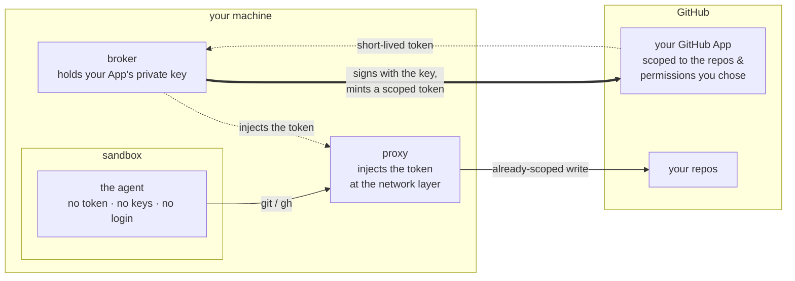
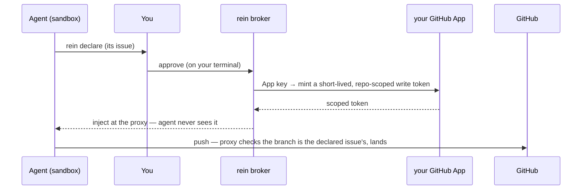

# rein

> [!WARNING]
> rein is an **experimental proof of concept**. The design, interfaces, and
> security guarantees are still settling, and the code has **not had an
> independent security review** — don't point it at anything you can't afford to
> lose, and use **throwaway repos only** for now. Kicking the tires, filing
> issues, and **external security reviews are very welcome**. Keep your existing
> protections in place.

**A local credential broker for AI coding agents — let a coding agent work on
GitHub without ever handing it your credentials.**

To let an agent push a branch or open a PR today, you give it a credential: a
`gh auth login`, a PAT in its environment, your SSH key. That credential is as
broad as *you* are, it lives as long as you let it, and anything that can read
the agent's memory or environment can take it. So you supervise every step, or
you accept that risk.

rein removes the credential from the agent entirely:

- **No standing credential to manage or leak** — no `gh auth login`, no PATs to
  mint, rotate, or revoke. rein brokers human-gated, short-lived tokens from
  **your own GitHub App**; they never sit in the agent's environment, files, or
  memory.
- **A blast radius you chose** — make your App key the only GitHub credential on
  the box, and even a full sandbox escape is capped at the scope you picked, never
  your whole account.
- **Yours, not ours** — the App is yours, the key stays on your machine, the
  tokens are minted locally. No rein service, no shared secret, nothing the rein
  authors can see, hold, or revoke.
- **Less babysitting** — because the agent is sandboxed (no credentials, egress
  limited to GitHub), running it with permissions off
  (`claude --dangerously-skip-permissions`) is **safer, though not safe** — it may
  still have other credentials you left reachable, and it can still do damage
  inside the scope you granted it. rein moves the approval that matters most —
  writing to GitHub — to a single per-issue gate.

### Where the credential lives



The key lives *outside* the sandbox and never crosses into it. What crosses the
boundary is an already-scoped, short-lived token, added at the network layer — so
a sandbox escape finds no token to steal, only the traffic it was already allowed
to make.

**Today that means Linux and a terminal** — macOS is a separate track, not yet
done. For the full design and threat model, see [`docs/design.md`](docs/design.md).

## Prerequisites

**Core:**
- **Go** — the version in [`go.mod`](go.mod) (currently 1.26.5+).
- A **GitHub account** that can create GitHub Apps (any personal account can).
- One or more **throwaway repositories** to point the agent at. Do not use a real
  repo yet. Clone them over **HTTPS** — rein brokers `https://github.com` remotes.
  An **SSH remote will not work** from inside the sandbox: rein has nothing to
  inject into it, there's no egress for it, and the ssh-agent socket is blocked.
- A browser for the one-time App creation. On a headless/SSH box, see
  [Headless setup](#headless--remote-machines).

**The sandbox stack (Linux)** — required for the default `rein run`. `rein doctor`
checks `srt` (presence and pinned version), its seccomp filter, bwrap's userns, and
the system CA bundle. It does **not** check `ripgrep`/`socat` (srt needs both),
Node, Go, or your clock — a bad clock shows up later as `app credentials: 401`.
- **`srt`** — pinned to `@anthropic-ai/sandbox-runtime@0.0.63` (other versions
  may move the injection hook; rein re-verifies on bump). srt needs Node 20+:
  `npm install -g @anthropic-ai/sandbox-runtime@0.0.63`
- **`bubblewrap`, `ripgrep`, `socat`** —
  `sudo apt-get install -y bubblewrap ripgrep socat` (or your distro's
  equivalent).
- **Ubuntu 23.10+ only:** an AppArmor profile granting `userns` to `bwrap`, or the
  sandbox won't start. Check with:

  ```bash
  bwrap --unshare-user --uid 0 --bind / / -- true   # if this errors, you need the profile
  ```

  Create `/etc/apparmor.d/bwrap` (this grants `userns` to `bwrap` alone — don't
  disable the sysctl system-wide, that weakens the whole box):

  ```
  abi <abi/4.0>,
  include <tunables/global>

  profile bwrap /usr/bin/bwrap flags=(unconfined) {
    userns,
    include if exists <local/bwrap>
  }
  ```

  Then `sudo apparmor_parser -r /etc/apparmor.d/bwrap` and re-run the check.
- **Healthy NTP** — App token mints fail with a misleading `401 Bad credentials`
  when the clock drifts more than ~60s.

## Quick start

```bash
git clone https://github.com/TomHennen/rein.git
cd rein
go build -o bin/ ./...
# install the sandbox stack (above), then:
./bin/rein init
./bin/rein doctor   # no [fail] rows ([warn] on $TMUX or the caches is normal)
```

`rein init` walks you through the whole setup and is idempotent — safe to re-run.
It:

1. **Creates your GitHub App(s)** — a **primary** App that mints your tokens, and
   an **audit** App (`--skip-audit` to skip; audit comments are coming soon). A
   browser opens to GitHub's "Create GitHub App" page with the permissions
   pre-filled (see [Token scopes](#token-scopes)); you click
   **Create**, then **Install** on your throwaway repo(s).

   **The browser has to reach rein on `127.0.0.1`** — that's how the App's key gets
   back to you. Working on a remote box over SSH? Set up the port-forward
   *first*: [Headless / remote machines](#headless--remote-machines).
2. **Stores the keys** in `~/.config/rein/` (mode `0600`). You never copy a key by
   hand.
3. **Puts `rein` on your `PATH`** (`~/.local/bin/rein`) and offers to alias
   `claude` to `rein run -- claude` (off by default).
4. **Offers to scaffold your [session](#the-session)** — the repo ceiling. On a
   terminal it asks which repo; with `--repo owner/name` it takes the flag;
   headless or with `--yes` it skips and says so. An existing session file is kept,
   never overwritten. `rein run` needs one before it will start.

Then **install the App on the repos you want**, using the deep-links rein prints.
Run `rein init --help` for the full flag set.

## Daily use

Open a new shell and run your agent:

```bash
rein run -- claude     # or just `claude`, if you installed the alias
```

The agent works read-only until it needs to write. Then it runs `rein declare
<issue>`, you get a confirmation prompt on your terminal, and its pushes go
through for the rest of the run.

## How rein works

### Declaring an issue



1. The agent runs `rein declare <issue-number>`. Every blocked write tells it to.
2. rein fetches the issue and shows you its title, state, and home repo. You
   confirm by typing the number back. The agent cannot reach or forge this prompt:
   it has no controlling terminal. rein asks in a `tmux` popup if you're in tmux,
   otherwise on your tty; failing both, it tells you to run `rein approval grant`
   from another terminal.
3. rein mints a short-lived write token from your App key.
4. The proxy injects the token into the agent's traffic. The agent never sees it.
5. The push goes through.

Confirming an issue covers that issue for the rest of the run — the agent can push
to it again without re-prompting. Declaring a different issue prompts you again.

Write access is revoked when the run ends, after 30 minutes with no GitHub
traffic, or after 4 hours, whichever comes first. Any request resets the idle
clock, reads included, so a busy agent stays approved until the 4-hour cap. (The
idle clock is a sandboxed-mode thing: `--direct` has no proxy, so it gets the
run-exit revoke and the 4-hour cap, but nothing in between.)

**What the issue binds.** GitHub tokens can't be scoped to an issue, so the token
is scoped to your session's repos. The issue constrains the *push*: an approved
run can only push to `agent/<issue>/<nonce>` for an issue you confirmed, and any
other branch — including `main` — is refused.

The token can do more than the branch rule allows. It carries `contents: write` on
your repos, so the agent can also write through GitHub's API, which the branch rule
doesn't cover. rein records those writes rather than blocking them: every request
it relays goes to a log the agent can't read or edit.

```bash
cat ~/.local/state/rein/audit/sandbox-<run-id>.log
```

Posting that history back to the issue, from an identity the agent can't touch, is
coming soon. For now the log is local. See [Known limits](#known-limits).

### The session

A session lists the repos the agent may touch. No token rein mints can exceed it.
`rein init` scaffolds one; edit it to change the repo set:

```yaml
id: my-session
role: implement
repos:
  - your-name/your-throwaway-repo   # the token is scoped to this whole set
```

There's no issue field: the issue is bound at run time, not at setup
([#35](https://github.com/TomHennen/rein/issues/35)). A file with a legacy
`issue:` line still loads, but the field is ignored with a warning — remove it.
`rein session show` prints the current repo set; `rein session add-repo
<owner/name>` widens it.

### Token scopes

You approve the App's permissions once, at creation. rein mints each token with
the narrowest set the operation needs:

| | contents | issues | pull_requests | metadata |
|---|---|---|---|---|
| Your primary App (the ceiling) | write | write | write | read |
| Read tier — before declare (`git` fetch, `gh pr view`) | read | read | read | read |
| Write tier — after you approve (`git push`, `gh pr create`) | write | write | write | read |
| Audit App — not yet posting | — | write | — | read |

The write token only exists once you approve, and is revoked when the run ends or
[expires](#declaring-an-issue). Both are scoped to your session's repos, not to
your account.

Those are the tiers the sandbox proxy mints. In `--direct` mode the git tokens are
narrower — `contents` only — and just the `gh` path gets the full write tier.

Note that on GitHub `pull_requests: write` also means review, approve, and merge,
so an approved run can approve or merge its own PR. Branch protection requiring an
approval won't stop it ([#86](https://github.com/TomHennen/rein/issues/86)).

### What the sandbox blocks

`rein run` launches the agent inside Anthropic's
[`sandbox-runtime`](https://github.com/anthropic-experimental/sandbox-runtime)
(`srt`). Inside it:

- **No direct egress.** srt runs the agent in an isolated network namespace
  (`bwrap --unshare-net`), so it has no route to the network of its own; its
  traffic reaches the outside only through rein's proxy socket. rein writes the
  egress allowlist srt enforces, and it permits GitHub plus the agent's own API
  (`api.anthropic.com`, so `rein run -- claude` works out of the box; another
  agent's API needs [allowing explicitly](#allowing-extra-network-egress)). The
  namespace isolation is srt's, not rein's — rein configures the allowlist and
  injects on the GitHub hosts.
- **Your `$HOME` is hidden.** rein denies the home directory wholesale and allows
  back only what the agent needs to run. Your credential stores are denied on top
  of that — `~/.config/gh`, `~/.ssh`, `~/.netrc`, git-credentials, `~/.gnupg`, your
  keyrings, and rein's own keys — and the keyring and ssh-agent sockets are
  blocked. A credential scanner run inside the sandbox finds none of your real
  credentials.
- **`.git` is protected** ([#64](https://github.com/TomHennen/rein/issues/64)).
  `hooks/` and `config` are read-only, and `.git` can't be renamed aside and
  rebuilt — otherwise the agent could plant a `pre-commit` hook that later runs as
  you, on your host. rein can't protect a submodule or a linked worktree this way,
  so it won't bind one: a mapped worktree fails the launch, and if it's your
  current directory the agent gets a scratch clone and your tree is untouched.
- **Writes are locked until declare.** Commits are authored `<your name> (via
  rein)` under the App's identity, so a push is attributable to the App rather than
  to you.
- **No credential in the environment.** The sandbox environment is an allowlist,
  and the `GH_TOKEN` the agent sees is a stub. The real token only exists on the
  wire.

If hiding `$HOME` breaks a tool you need, `REIN_SANDBOX_ALLOW_READ` allows
specific paths back read-only (never a credential store — rein rejects those), and
`REIN_SANDBOX_SHOW_HOME` turns the whole `$HOME` deny off.

### Allowing extra network egress

Anything that isn't GitHub or the agent's own API — the npm registry, PyPI, a
remote MCP server — is unreachable until you allow its host. Add hosts to
`allow_domains` in your session yaml, or set `REIN_ALLOW_DOMAINS`
(comma-separated) machine-wide:

```yaml
allow_domains:
  - registry.npmjs.org
  - pypi.org
```

Allowed hosts are egress-only: rein never injects a credential on them, only on
GitHub. Entries are bare hosts (`pypi.org`) or a strict wildcard
(`*.example.com`). Every host you add is somewhere the agent can send your data, so
keep the list short. rein warns on wildcards and on large sets.

MCP servers follow the same rule: local stdio servers work out of the box, remote
ones connect only if you allow their hosts. The claude.ai account connectors also
need `claude.ai`; `REIN_DISABLE_CLAUDE_MCP=1` turns them off.

### `--direct` mode

Where there's no working sandbox, `rein run --direct -- <cmd>` uses a git
credential helper instead. The agent runs unsandboxed and can reach your ambient
credentials, so it's weaker by design — rein prints a banner, and it's for
throwaway repos only. You still declare and confirm, but rein never sees the
branch being pushed, so an approved `--direct` run can push any ref.

## Known limits

rein makes an agent safer to run, not safe to trust.

- **Linux only.** macOS is a separate track, not yet done.
- **Throwaway repos only, for now.** The sandbox closes the credential-exfiltration
  gap, but none of this has been dogfooded on a real repo yet.
- **rein only helps if it's the only credential on the box.** If you also keep a
  broad `gh` login or a PAT around, an escaped agent gets those instead. rein
  removes your reason to have them; it doesn't remove them.
- **The key is protected by file permissions and the sandbox, not by hardware.**
  Hardware-backed keys are on the roadmap.
- **The sandbox is defense-in-depth, not a hard boundary.** An escape re-exposes
  the weaker `--direct` surface. It also only stops the agent: anything else
  running as you on the host can still reach your credentials. rein defends against
  a prompt-injected agent, not against malware already running as you.
- **An approved run can approve or merge its own PR**
  ([#86](https://github.com/TomHennen/rein/issues/86)), and can write through the
  API to branches the push rule would block, including `main`
  ([#109](https://github.com/TomHennen/rein/issues/109)). Those are **recorded, not
  blocked** — and until audit writeback ships, that record is a local file, not
  something a PR reviewer will ever see.

## Headless / remote machines

The App-creation step needs a browser that can reach rein's loopback callback. On
a headless or SSH-only box, rein detects this and prints a ready-to-paste `ssh -L`
recipe. For a predictable port, pin it:

```bash
rein init --port 41234                      # on the remote box
ssh -L 41234:127.0.0.1:41234 you@remote     # on your laptop
# then open the printed http://127.0.0.1:41234/ in your laptop browser
```

If port-forwarding is blocked entirely, see the manual fallback in
[`docs/init-manifest-design.md`](docs/init-manifest-design.md) — read its **Safe
handling of the App private key** section before moving a key by hand.

## Troubleshooting

**Start with `rein doctor`** — it checks everything above and tells you what's
wrong. `rein doctor --fix` applies the repairs it can make safely; anything
privileged (apt, npm, AppArmor, NTP) it shows you but never runs.

- **`sandbox: ...` check fails** — install the missing piece from
  [Prerequisites](#prerequisites); on Ubuntu 24.04 the usual culprit is the
  `bwrap` AppArmor profile. `rein run` won't launch until these pass.
- **`app credentials: 401`** — almost always clock skew; check `chronyc tracking`.
- **`claude` doesn't go through rein** — open a new shell, or `source` your rc;
  confirm with `type claude`.
- **`rein: command not found`** — `~/.local/bin` isn't on your `$PATH`.
- **A git op fails, mentioning `rein doctor`** — rein refused rather than letting
  the agent silently re-auth. Usually the App isn't installed on that repo, or the
  repo is outside your session's ceiling.
- **Write prompt never appears** — the agent must run `rein declare <n>` first.
  If it did and no prompt reached you, you may be in `--direct` from a shell with
  no tty; run from a real terminal, or approve from another with `rein approval
  grant --run-id <id>`.
- **Logs** — what the agent did, per run: `~/.local/state/rein/audit/`.

## Running the tests

Three layers, hermetic to live:

```bash
go test ./...                                  # unit — no network, no sandbox, no secrets
go test -race ./...                            # the concurrency-sensitive packages

REIN_SANDBOX_E2E=1 go test ./internal/srt -run E2E   # launches real srt; needs the stack healthy

tests/interactive/run-journeys.sh              # journeys: real pty, real repo, golden transcripts
tests/interactive/run.sh                       # the rest of the interactive suite
```

The **journeys** are the ones that matter: each drives a real user path against a
live throwaway repo and checks the transcript against a committed golden, so any
drift shows up as a failure. Regenerate them in any PR that changes behavior. They
need `rein init` run on the box, the sandbox stack, host `gh` authed, and
`python3` + `pexpect`; see
[`tests/interactive/README.md`](tests/interactive/README.md). The interactive
suite is **never** run by `go test ./...`, so the Go suite stays fast and offline.

## Cleanup

- Delete the Apps you created at <https://github.com/settings/apps> (GitHub has no
  API to delete an App).
- Remove `~/.config/rein/` (your keys and session) and `~/.local/state/rein/`
  (logs and caches).
- Remove the `~/.local/bin/rein` symlink and the `# BEGIN/END rein-credentials
  managed block` from your shell rc (or `~/.config/fish/functions/claude.fish`).
