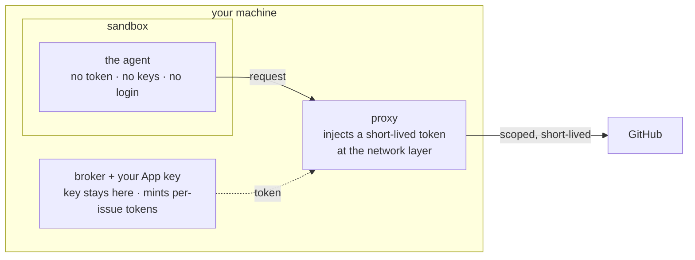
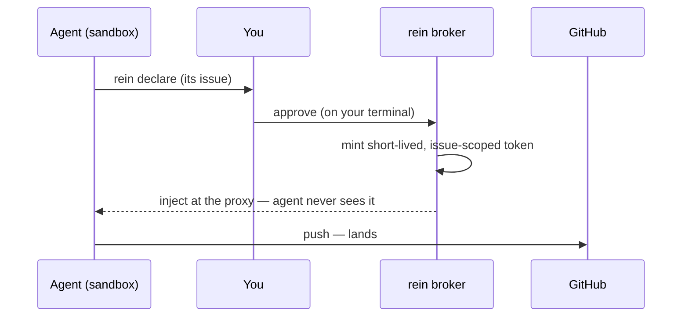

# rein

> [!WARNING]
> rein is an **experimental proof of concept**. The design, interfaces, and
> security guarantees are still settling, and the code has **not had an
> independent security review** — don't point it at anything you can't afford to
> lose, and use **throwaway repos only** for now. Kicking the tires, filing
> issues, and **external security reviews are very welcome**. Keep your existing
> protections in place.

**A local credential broker for AI coding agents — let a coding agent work on
GitHub without ever handing it your credentials.**

<!-- DEMO: replace this line with a recording (asciinema → gif, or an mp4) of a
     real `claude` session under rein — the agent hits a write, `rein declare`
     fires, the tmux popup asks for approval, you confirm, and the push lands.
     That write-approval popup is the money shot. -->
> 🎬 **Demo coming:** a real `claude` session under rein — the write-approval
> popup firing and the push landing. *(placeholder — recording in progress)*

You create a GitHub App — one you own, not rein — scoped to exactly the repos and
permissions you're willing to risk. rein keeps its key on your machine; when the
agent needs to write, it declares an issue and you approve on your terminal, and
rein mints a short-lived token for just that work and injects it into the agent's
sandbox at the network layer. The agent never sees a token or your login.

You don't have to `gh auth login` or mint and rotate scoped PATs — the only GitHub
credential on the box is your own narrowly-scoped App. So the worst case, even if
the agent breaks out of the sandbox, is capped at the scope you chose, never your
whole account. And it's a local broker: no rein service, no shared secret, nothing
the rein authors can ever see or hold.

**Where it works today:** Linux · a terminal · `tmux` for the approval popup.
(macOS is a separate, not-yet-done track.) For the full design and threat model,
see [`docs/design.md`](docs/design.md) and
[`docs/phase1-design.md`](docs/phase1-design.md).

### Where the credential lives



The key lives *outside* the sandbox and never crosses into it. What crosses the
boundary is an already-scoped, short-lived token, added at the network layer — so a
sandbox escape finds no token to steal, only the traffic it was already allowed to
make.

### How it works, in one breath



1. The agent needs to write, so it runs `rein declare` for its issue.
2. You approve it on your terminal (a `tmux` popup, by default).
3. rein mints a short-lived token scoped to just that issue.
4. The proxy injects it into the agent's traffic — the agent never sees it.
5. The push lands.

### What this gets you

- **No standing credential to manage or leak** — no `gh auth login`, no scoped PATs
  to mint, rotate, or revoke. rein brokers per-issue, human-gated, short-lived tokens
  from your own App; they never sit in the agent's environment.
- **A blast radius you chose** — the only GitHub credential on the box is your scoped
  App key, so even a full sandbox escape is capped at the App scope you picked, never
  your account.
- **Yours, not ours** — the App is yours, the key stays on your machine, the tokens are
  minted locally. No rein service, no shared secret, nothing the rein authors can see,
  hold, or revoke.

### What rein does and doesn't protect (stated plainly)

- **Give the agent no standing GitHub credential.** That's the precondition that makes
  the bounded-blast-radius property true — if you *also* keep a broad `gh` login or PAT
  on the box, a sandbox escape gets those too. rein removes the reason to.
- **"Protected by the sandbox" means the agent can't reach the key** — it lives outside
  the sandbox, used only by the broker. A credential scanner run *inside* the sandbox
  finds none of your real credentials.
- **Not "hardware-protected" — yet.** Today the App key is a file protected by OS
  permissions plus the sandbox keeping the agent away from it. Hardware / host-keychain
  wrapping is defense-in-depth on the roadmap.

> **Status (2026-07-06).** Phase 1 **sandboxed mode is built and is the
> default**: `rein run` launches the agent inside Anthropic's
> [`sandbox-runtime`](https://github.com/anthropic-experimental/sandbox-runtime)
> (`srt`) and injects credentials at a local proxy. A **real agent (`claude`)
> runs end-to-end** in the sandbox. It is **Linux-only** for now
> (macOS is a separate, not-yet-done track — see design §5.4). A credential-helper
> "direct" mode remains behind `--direct` as a fallback where there's no sandbox.
> **Use throwaway repos only** until the sandbox has been dogfooded — see
> [Known limits](#known-limits).

## Prerequisites

**Core:**
- **Go** — the version in [`go.mod`](go.mod) (currently 1.26+).
- A **GitHub account** that can create GitHub Apps (any personal account can).
- One or more **throwaway repositories** to point the agent at. Do not use a
  real repo yet. Clone them over **HTTPS** (`https://github.com/...`) — rein
  brokers `https://github.com` remotes; an **SSH remote bypasses the proxy** and
  is blocked inside the sandbox (no token, no egress).
- A browser to complete the one-time App creation. On a headless/SSH box, see
  [Headless setup](#headless--remote-machines).

**The sandbox stack (Linux)** — required for the default `rein run`; `rein
doctor` checks all of these and tells you exactly what's missing:
- **`srt`** — pin `@anthropic-ai/sandbox-runtime@0.0.63` (rein re-verifies on
  bump; other versions may move the injection hook). Needs Node 20+:
  `npm install -g @anthropic-ai/sandbox-runtime@0.0.63`
- **`bubblewrap`, `ripgrep`, `socat`** — `sudo apt-get install -y bubblewrap ripgrep socat`
  (or your distro's equivalent). The `apply-seccomp` helper that blocks the
  agent from reaching keyring/agent sockets ships with `srt`.
- **Ubuntu 24.04+ only:** an AppArmor profile granting `userns` to `bwrap`, or
  the sandbox won't start. Check with
  `bwrap --unshare-user --uid 0 --bind / / -- true`; if it errors, see the
  fix in [`HANDOFF.md`](HANDOFF.md) (§1b).
- **Healthy NTP** — GitHub App token mints fail with a misleading
  `401 Bad credentials` when the clock drifts >~60s. Keep time sync on
  (`chronyc tracking` should show ~0 seconds off).

## Install

```bash
git clone https://github.com/TomHennen/rein.git
cd rein
go build -o bin/ ./...
# install the sandbox stack (see Prerequisites), then:
./bin/rein init
./bin/rein doctor   # every check should be [ok] — including the sandbox: rows
```

`rein init` is idempotent — safe to re-run.

## First-time setup

`rein init` walks you through everything. On a fresh machine it will:

1. **Create your GitHub App(s).** A browser opens to GitHub's "Create GitHub
   App" page with the right permissions pre-filled. Click **Create**, then
   **Install** it on your throwaway repo(s). rein creates a **primary** App
   (mints your tokens) and — unless you pass `--skip-audit` — an **audit** App
   (reserved for audit-comment writeback, a later track; created now but not yet
   posting), each in its own browser step. Use `--owner=<your-login>` so rein
   refuses if you accidentally create the App under the wrong account.
2. **Store the keys.** The private keys are written to
   `~/.config/rein/{primary,audit}.pem` (mode `0600`) and the App details to
   `~/.config/rein/state.json`. You never copy a key by hand. rein's local CA
   (used to inject on the wire) is generated on first `rein run` and stored the
   same way. **No `REIN_APP_*` environment variables are needed** — rein reads
   `state.json` and fetches the installation id automatically on first use.
3. **Wire up your shell.** rein installs its git/`gh` shims and puts `rein` on
   your `PATH` (`~/.local/bin/rein`). The `alias claude='rein run -- claude'`
   convenience is **opt-in** and is **not installed by default**. On a real
   terminal init asks *"Add alias claude='rein run -- claude' to <rc>? [y/N]"*
   (defaulting to **No**); pass `--alias` to install it non-interactively, or
   `--no-alias` to force-skip. If you pass both, `--no-alias` wins. Headless/CI
   runs and `--yes` never prompt and skip the alias. Without the alias, launch
   with `rein run -- claude`; you can enable it later with `rein init --alias`.
4. **Scaffold your dev session.** init writes `~/.config/rein/dev-session.yaml`
   scoped to a repo you name. It takes the repo from `--repo owner/name`, else it
   prompts *"Which repo should the agent work on?"* (Enter to skip). On a
   headless/CI run or with `--yes`, and no `--repo` given, it skips scaffolding
   gracefully — init **never blocks on a prompt**. Re-running init keeps an
   existing session file.

**Sandbox-stack health.** At the end of its run, init checks the sandbox stack
(the same `sandbox: ...` rows `rein doctor` reports). If anything is unhealthy it
**soft-blocks**: init still finishes all its other setup, then prints a loud,
specific warning naming each failing check and pointing you at `rein doctor` and
the [Prerequisites](#prerequisites) — but exits 0. Pass `--require-sandbox` to
make it **hard-fail** (non-zero exit) instead, e.g. in CI. Either way the real
enforcement is at `rein run`, which **fails closed** and refuses to launch a
sandboxed run on a broken stack.

After init, **install the App on the repos you want** using the deep-links rein
prints (`https://github.com/apps/<slug>/installations/new`).

### The session (scaffolded by init)

A *session* sets the scope ceiling — which repos the agent may touch. **`rein
run` will not start without one**, and `rein init` scaffolds it for you (step 4
above). You only hand-edit `~/.config/rein/dev-session.yaml` to change the repo
set or to enable writes. What init writes is **repo-only**:

```yaml
id: my-session
role: implement
repos:
  - your-name/your-throwaway-repo   # the token is scoped to this whole set
```

**Why no issue field?** The issue is bound at *runtime*, not at setup
([#35](https://github.com/TomHennen/rein/issues/35)): the agent **declares**
which issue its work is for (`rein declare <n>`), rein fetches that issue and
shows you its **title, state, and home repo** on your terminal, and you confirm
by typing the displayed number. That one ceremony unlocks writes for the run
(git push, gh, API); every push is still verified against the
`agent/<issue>/<nonce>` branch convention in sandboxed mode. A session file
with a legacy `issue:` line still loads, but the field is **ignored** (with a
loud warning) — remove it.

**Direct mode (`--direct`) deltas, stated up front:** the same declare +
confirm model applies, but (1) the credential helper never sees push refs, so
the `agent/<issue>/<nonce>` cross-check is a sandboxed-only property — an
approved direct-mode run can push any ref; and (2) pre-declaration write
attempts do reach GitHub carrying a placeholder credential (GitHub rejects
them) rather than being answered locally.

## Daily use

Open a new shell (so the alias is live) and just run your agent:

```bash
claude
```

The alias routes it through `rein run`, which **sandboxes by default**. Inside
that sandbox:

- The agent has **no direct network egress** — all GitHub traffic goes through
  rein's proxy, which injects a fresh, repo-scoped token on the wire. The token
  is never in the agent's environment, files, or memory.
- Your **own credentials are hidden**: `~/.config/gh`, `~/.ssh`, `~/.netrc`,
  git-credentials, and the keyring/ssh-agent sockets are unreadable in the
  sandbox. The environment is a strict allowlist, not a passthrough.
- **Writes are locked until the agent declares its issue** (`rein declare <n>`,
  #35). The declaration triggers the confirmation prompt in your terminal (the
  agent cannot reach or forge it — it has no controlling terminal), showing the
  fetched issue title + home repo. One confirmation covers the run; pushes must
  use `agent/<issue>/<nonce>` branches and are verified against what you
  confirmed. The session also expires on idle (30m) or a hard cap (4h),
  revoking the write token.
- Commits the agent makes are authored as **`<your name> (via rein)`** with the
  App's identity, so a push is attributable to the rein App, not to you
  personally. (Configurable via `REIN_GIT_AUTHOR_TEMPLATE`.)
- The agent gets a **private writable temp dir automatically** — rein creates a
  per-run scratch directory and wires it in as the sandbox's `TMPDIR`, so tools
  that need scratch space (the agent itself, `npm`, builds) work without EROFS.
  It is ephemeral (torn down on exit), holds nothing sensitive, and needs no
  configuration from you.

`rein run -- claude` runs a **real agent end-to-end** in the sandbox — it starts,
reaches its own API, reads/writes the working tree, and pushes through the
approval prompt.

To run the agent *without* the alias for one invocation: `\claude` (bash/zsh) or
`command claude` (fish).

### Allowing extra network egress (npm, PyPI, MCP, …)

By default the sandbox blocks **all** network egress except two things: GitHub
(brokered through rein's proxy) and the wrapped agent's **own API**
(`api.anthropic.com` for `claude`, allowed automatically so `rein run -- claude`
works out of the box). Anything else — the npm registry, PyPI, a remote MCP
server — is unreachable until you allow its host explicitly.

Add hosts to the **`allow_domains`** allowlist, either per session or
machine-wide:

```yaml
# in your session yaml — allow just this run's extra egress
allow_domains:
  - registry.npmjs.org
  - pypi.org
```

```bash
# or machine-wide, for every sandboxed run (comma-separated)
export REIN_ALLOW_DOMAINS="registry.npmjs.org,pypi.org"
```

Allowed hosts get a **direct TLS tunnel to themselves** — rein injects **no**
credential on them (they are egress-only; only GitHub gets an injected token).
Entries are bare hosts (`pypi.org`) or a strict wildcard (`*.example.com`).
Because a sandboxed agent can send data to any allowed host, **widening egress is
a data-exfiltration surface**: rein prints a loud `EGRESS WARNING` for each
wildcard and for a large custom set. Keep the list minimal and deliberate.

### MCP servers in the sandbox

Claude Code's MCP servers work under `rein run`, with one rule: **an MCP server's
network host must be reachable**, i.e. in `allow_domains`.

- **Local / stdio MCP servers** (added with `claude mcp add`, a project
  `.mcp.json`, or `mcpServers` in settings) run as a **subprocess inside the
  sandbox** and need **no egress** — they work out of the box. (Verified: a local
  stdio MCP tool is callable in-sandbox.)
- **Remote MCP servers, and the account / claude.ai connectors** (Todoist, Gmail,
  Google Drive/Calendar synced from your Claude account) reach **network hosts**,
  so they connect only when those hosts are in `allow_domains`. rein **no longer
  force-disables** these connectors; claude connects them **non-blocking**, so an
  unreachable one fails quietly in the background rather than hanging startup
  (tested: with connectors enabled and their hosts unallowed, the agent starts
  and answers normally). Note the account connectors typically also need
  **`claude.ai`** egress to authenticate/fetch, on top of the third-party host
  (e.g. Todoist) — allow both, or expect them to stay unconnected. To turn the
  account connectors off entirely (minimal egress surface), set
  **`REIN_DISABLE_CLAUDE_MCP=1`**.

**To use an MCP server in the sandbox:**

1. Configure it the way you normally would for Claude Code (`claude mcp add …`,
   a project `.mcp.json`, or settings `mcpServers`).
2. If it is **remote**, add its host to `allow_domains` (session field or
   `REIN_ALLOW_DOMAINS`). Local stdio servers skip this step.
3. Run `rein run -- claude`. The server loads inside the sandbox; a remote one
   connects only if its host is allowed (egress only — never an injected token).

**`--direct` (fallback, throwaway only).** Where there's no working sandbox,
`rein run --direct -- <cmd>` runs the credential-helper path instead — the agent
runs *unsandboxed* and can reach ambient credentials, so it's weaker by design.
rein prints a loud banner; use it only on throwaways. If the sandbox stack is
unhealthy, the default `rein run` **fails closed** and points you at `rein
doctor` rather than silently dropping protection.

## Headless / remote machines

The App-creation step needs a browser that can reach rein's loopback callback.
On a headless or SSH-only box, rein detects this and prints a ready-to-paste
`ssh -L` recipe. For a predictable port, pin it:

```bash
# on the remote box:
rein init --port 41234
# on your laptop (the recipe rein prints):
ssh -L 41234:127.0.0.1:41234 you@remote
# then open the printed http://127.0.0.1:41234/ in your laptop browser
```

This keeps the automated, safe key import end-to-end. If port-forwarding is
blocked entirely, see the manual fallback in
[`docs/init-manifest-design.md`](docs/init-manifest-design.md) (and its
**Safe handling of the App private key** section — read it before moving a key
by hand).

## Troubleshooting

**Start with `rein doctor`** — it runs read-only checks (rein on `PATH`, shim
freshness, key readable, App credentials, session, the **sandbox stack** — srt
present + pinned version, seccomp, bwrap userns — `$TMUX`, caches) and tells you
what's wrong.

- **`sandbox: ...` check fails** — install the missing piece from
  [Prerequisites](#prerequisites); on Ubuntu 24.04 the usual culprit is the
  `bwrap` AppArmor profile. The default `rein run` won't launch until these pass.
- **`app credentials: 401`** — almost always clock skew; check `chronyc tracking`.
- **`claude` doesn't go through rein** — open a new shell, or `source` your rc;
  confirm the alias with `type claude`.
- **`rein: command not found`** (in a fresh shell, via the alias) — `~/.local/bin`
  isn't on your `$PATH`. Add it: `export PATH="$HOME/.local/bin:$PATH"`.
- **A git op fails, `rein doctor` mentioned on stderr** — rein refused rather
  than letting the agent silently re-auth. Usually the App isn't installed on
  that repo, or the repo is outside your session's scope ceiling.
- **Write prompt never appears** — prompts fire at *declare* time now (#35):
  the agent must run `rein declare <n>` first (every blocked write says so).
  If the declare ran but no prompt reached you, you may be using `--direct`
  from a shell with no tty; run from a real terminal, or approve from another
  with `rein approval grant --run-id <id>`.
- **Logs** — per-run audit log (token-redacted): `~/.local/state/rein/audit/`;
  direct-mode credential helper: `~/.local/state/rein/helper.log`.

## Running the tests

Three layers, from hermetic to live:

- **Unit / hermetic** — the Go suite. No network, no sandbox, no secrets; safe
  anywhere:

  ```bash
  go test ./...
  go test -race ./...        # the concurrency-sensitive packages
  ```

- **Gated sandbox e2e** — actually launches `srt` to prove the deny-read +
  seccomp self-test applies on this machine. Needs the sandbox stack healthy
  (`rein doctor`); off by default so `go test ./...` stays hermetic:

  ```bash
  REIN_SANDBOX_E2E=1 go test ./internal/srt -run E2E
  ```

- **Interactive (pexpect) suite** — drives the real `rein` binary through a pty
  against a **live throwaway repo + a working App**: the write-approval loop and
  a real-agent (`claude`) end-to-end run. Prereqs: `source ./dev-env` (sets
  `REIN_*`, incl. a **throwaway** `REIN_TEST_REPO_A`), the sandbox stack, host
  `gh` authed, and `python3` + `pexpect`. See
  [`tests/interactive/README.md`](tests/interactive/README.md).

  ```bash
  tests/interactive/run.sh                    # whole suite
  tests/interactive/run.sh test_write_approval # one module
  tests/interactive/run.sh test_realagent_e2e  # the real-agent e2e (runs one claude)
  ```

  The interactive suite is **never** run by `go test ./...` (no `.go` files
  under `tests/interactive/`), so the Go suite stays fast and offline.

## Known limits

- **Linux only.** macOS (a different sandbox backend and CA-trust path) is a
  separate track, not yet done (design §5.4).
- **Throwaway repos only, for now.** The sandbox closes the credential-
  exfiltration gap, but the spine hasn't been dogfooded on a real repo yet;
  crossing that line is a deliberate step, not a default.
- **Same-UID residual.** The sandbox stops the *agent*. A separate process
  running as **your own user** on the host can still reach rein's proxy socket
  and your ambient credentials — that's outside rein's threat model (host
  hygiene). rein defends against a prompt-injected agent, not against malware
  already running as you. See design §5.3.
- **The sandbox is defense-in-depth, not a hard boundary** — an `srt` escape
  re-exposes the direct-mode surface. One layer, honestly stated.

## Cleanup

- Delete the Apps you created at <https://github.com/settings/apps> (GitHub has
  no API to delete an App).
- Remove `~/.config/rein/` (keys, CA, state, session) and
  `~/.local/state/rein/` (shims, logs, audit, caches). Per-run proxy sockets
  live under `$XDG_RUNTIME_DIR/rein/` and are removed when the run exits.
- Remove the `~/.local/bin/rein` symlink and the `# BEGIN/END rein` alias block
  from your shell rc (or `~/.config/fish/functions/claude.fish`).
