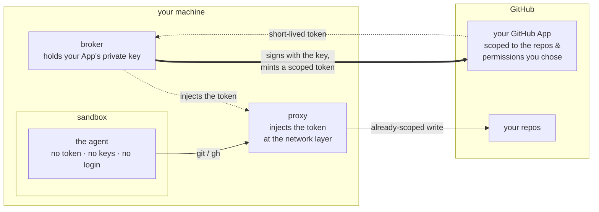
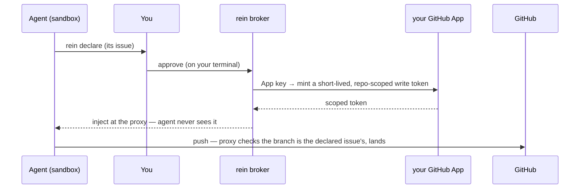

# rein

> [!WARNING]
> rein is an **experimental proof of concept**. The design, interfaces, and
> security guarantees are still settling, and the code has **not had an
> independent security review** — don't point it at anything you can't afford to
> lose, and use **throwaway repos only** for now. Kicking the tires, filing
> issues, and **external security reviews are very welcome**. Keep your existing
> protections in place.

**A local credential broker for AI coding agents — let a coding agent work on
GitHub without ever handing it your credentials.**

To let an agent push a branch or open a PR today, you give it a credential: a
`gh auth login`, a PAT in its environment, your SSH key. That credential is as
broad as *you* are, it lives as long as you let it, and anything that can read
the agent's memory or environment can take it. So you supervise every step, or
you accept that risk.

rein removes the credential from the agent entirely:

- **No standing credential to manage or leak** — no `gh auth login`, no PATs to
  mint, rotate, or revoke. rein brokers human-gated, short-lived tokens from
  **your own GitHub App**; they never sit in the agent's environment, files, or
  memory.
- **A blast radius you chose** — the only GitHub credential on the box is your
  scoped App key, so even a full sandbox escape is capped at the App scope you
  picked, never your account.
- **Yours, not ours** — the App is yours, the key stays on your machine, the
  tokens are minted locally. No rein service, no shared secret, nothing the rein
  authors can see, hold, or revoke.
- **Autonomy without the babysitting** — because the agent is boxed (no
  credentials, egress limited to GitHub), you can run it with permissions off
  (`claude --dangerously-skip-permissions`) instead of approving every tool call.
  rein moves the one approval that matters — writing to GitHub — to a single
  per-issue gate. Containment replaces permission fatigue.

### Where the credential lives



The key lives *outside* the sandbox and never crosses into it. What crosses the
boundary is an already-scoped, short-lived token, added at the network layer — so
a sandbox escape finds no token to steal, only the traffic it was already allowed
to make.

**Where it works today:** Linux, a terminal, and `tmux` for the approval popup.
macOS is a separate, not-yet-done track. `rein run` **sandboxes by default**; a
credential-helper **`--direct`** mode remains as a fallback where there's no
sandbox. For the full design and threat model, see
[`docs/design.md`](docs/design.md) and
[`docs/phase1-design.md`](docs/phase1-design.md).

## Prerequisites

**Core:**
- **Go** — the version in [`go.mod`](go.mod) (currently 1.26+).
- A **GitHub account** that can create GitHub Apps (any personal account can).
- One or more **throwaway repositories** to point the agent at. Do not use a real
  repo yet. Clone them over **HTTPS** — rein brokers `https://github.com` remotes.
  An **SSH remote will not work** from inside the sandbox: rein has nothing to
  inject into it, there's no egress for it, and the ssh-agent socket is blocked.
- A browser for the one-time App creation. On a headless/SSH box, see
  [Headless setup](#headless--remote-machines).

**The sandbox stack (Linux)** — required for the default `rein run`. `rein
doctor` checks every one of these and tells you exactly what's missing:
- **`srt`** — pinned to `@anthropic-ai/sandbox-runtime@0.0.63` (other versions
  may move the injection hook; rein re-verifies on bump). Needs Node 20+:
  `npm install -g @anthropic-ai/sandbox-runtime@0.0.63`
- **`bubblewrap`, `ripgrep`, `socat`** —
  `sudo apt-get install -y bubblewrap ripgrep socat` (or your distro's
  equivalent).
- **Ubuntu 24.04+ only:** an AppArmor profile granting `userns` to `bwrap`, or
  the sandbox won't start. Check with
  `bwrap --unshare-user --uid 0 --bind / / -- true`; if it errors, see the fix in
  [`HANDOFF.md`](HANDOFF.md) (§1b).
- **Healthy NTP** — App token mints fail with a misleading `401 Bad credentials`
  when the clock drifts more than ~60s.

## Quick start

```bash
git clone https://github.com/TomHennen/rein.git
cd rein
go build -o bin/ ./...
# install the sandbox stack (above), then:
./bin/rein init
./bin/rein doctor   # every check should be [ok] — including the sandbox: rows
```

`rein init` walks you through the whole setup and is idempotent — safe to re-run.
It:

1. **Creates your GitHub App(s).** A browser opens to GitHub's "Create GitHub
   App" page with the permissions pre-filled (see [Token
   scopes](#what-your-app-and-its-tokens-can-do)). You click **Create**, then
   **Install** it on your throwaway repo(s). rein creates a **primary** App
   (mints your tokens) and, unless you pass `--skip-audit`, an **audit** App
   (reserved for audit-comment writeback — created now, not yet posting).
2. **Stores the keys.** Private keys land in `~/.config/rein/{primary,audit}.pem`
   (mode `0600`) and the App details in `~/.config/rein/state.json`. You never
   copy a key by hand, and you need **no `REIN_APP_*` environment variables** —
   those are a legacy/dev override, not part of this path.
3. **Wires up your shell.** rein installs its git/`gh` shims and puts `rein` on
   your `PATH` (`~/.local/bin/rein`). The `alias claude='rein run -- claude'` is
   **opt-in** — init asks, defaulting to **No**. Without it, launch with `rein run
   -- claude`.
4. **Scaffolds your session** (`~/.config/rein/dev-session.yaml`) — the scope
   ceiling described [below](#the-session-sets-the-scope-ceiling). `rein run` will
   not start without one.

Run `rein init --help` for the full flag set (`--owner`, `--repo`, `--alias`,
`--require-sandbox`, `--yes`, …). If the sandbox stack is unhealthy, init
**soft-blocks**: it finishes the rest of its setup, warns loudly, and exits 0
(`--require-sandbox` makes it hard-fail instead). The real enforcement is at `rein
run`, which **fails closed** and refuses to launch on a broken stack.

After init, **install the App on the repos you want** using the deep-links rein
prints (`https://github.com/apps/<slug>/installations/new`).

## Daily use

Open a new shell and run your agent:

```bash
rein run -- claude     # or just `claude`, if you installed the alias
```

That's the whole loop. The agent works read-only until it needs to write; then it
runs `rein declare <issue>`, **you** get a confirmation prompt on your terminal,
and from there its pushes land. Everything below explains what's happening
underneath.

## How rein works

### The write ceremony



1. The agent needs to write, so it runs `rein declare <issue-number>`. Every
   blocked write tells it to.
2. rein fetches that issue and shows you its **title, state, and home repo** on
   your terminal (a `tmux` popup by default). You confirm by typing the displayed
   number. The agent **cannot reach or forge this prompt** — it has no controlling
   terminal.
3. rein mints a short-lived write token from your App key.
4. The proxy injects it into the agent's traffic on the wire — the agent never
   sees it.
5. The push lands.

One confirmation covers the run. The run's write capability expires on idle
(30 minutes) or at a hard cap (4 hours), whichever comes first.

**What the issue actually binds.** GitHub installation tokens cannot be scoped to
an issue, so the token rein mints is scoped to your session's **repos**. The issue
binding is enforced separately, **at the proxy**: an approved run may only push to
`refs/heads/agent/<issue>/<nonce>` for the issue you confirmed, and any other ref
is refused on the wire. Two mechanisms, stated separately, because they have
different failure modes — see `internal/proxy/receivepack.go` and design §4.2.

### The session sets the scope ceiling

A *session* is the set of repos the agent may touch — the ceiling a token can
never exceed. `rein init` scaffolds it; you hand-edit it to change the repo set:

```yaml
id: my-session
role: implement
repos:
  - your-name/your-throwaway-repo   # the token is scoped to this whole set
```

**Why no issue field?** The issue is bound at *runtime*, not at setup
([#35](https://github.com/TomHennen/rein/issues/35)) — the agent declares it, you
confirm it. A session file with a legacy `issue:` line still loads, but the field
is **ignored** (with a loud warning); remove it. Use `rein session show` to see
the standing ceiling and any live expansions, and `rein session add-repo
<owner/name>` to widen it.

### What your App and its tokens can do

You consent to the App's permissions once, at creation. rein then mints each
token with the **narrowest** set the operation needs, so a stolen token is worth
less than the App itself:

| | contents | issues | pull_requests | metadata |
|---|---|---|---|---|
| **Your primary App** — the ceiling you consent to at creation | write | write | write | read |
| **Read tier** — before declare (`git` fetch, `gh pr view`, …) | read | read | read | read |
| **Write tier** — after you approve (`git push`, `gh pr create`, …) | write | write | write | read |
| **Audit App** — writeback, created but not yet posting | — | write | — | read |

The read token is cached for its lifetime; the write token is minted
just-in-time and **revoked as soon as the call finishes**. Both are scoped to
your session's repos — never to your account.

> **Note:** `pull_requests: write` also confers PR *review, approve, and merge*
> capability, so a run holding the write token could approve or merge its own PR.
> If you rely on branch protection requiring approvals, treat the App's identity
> as a valid approver path
> ([#86](https://github.com/TomHennen/rein/issues/86), design §4.2.8).

### What the sandbox actually blocks

`rein run` launches the agent inside Anthropic's
[`sandbox-runtime`](https://github.com/anthropic-experimental/sandbox-runtime)
(`srt`). Inside it:

- **No direct network egress.** GitHub traffic goes through rein's proxy, which
  TLS-terminates and injects the token on `github.com`, `api.github.com`, and
  `uploads.github.com`. GitHub's CDN hosts (`codeload`, `raw.githubusercontent`,
  …) are allowed through as **plain egress with no token injected**. One more host
  is allowed by default: `api.anthropic.com`, so `rein run -- claude` works out of
  the box. That default is a fixed constant, not derived from the agent you wrap —
  a different agent's API needs
  [allowing explicitly](#allowing-extra-network-egress).
- **Your `$HOME` is hidden.** rein denies reads of your home directory
  *wholesale* and allows back only a curated list (the agent's install chain, its
  config, a toolchain set: `~/.cargo`, `~/go`, `~/.pyenv`, …). Credential stores
  are **additionally** denied belt-and-suspenders — `~/.config/gh`, `~/.ssh`,
  `~/.netrc`, git-credentials, `~/.gnupg`, the Secret Service and kwallet
  keyrings, cargo credentials, and rein's own key dir — and the keyring/ssh-agent
  **sockets** are blocked by a seccomp rule verified live before launch. It fails
  closed: if rein can't resolve your home or config dir, it refuses to launch. A
  credential scanner run *inside* the sandbox finds none of your real credentials.
- **`.git` is pinned** ([#64](https://github.com/TomHennen/rein/issues/64)). Its
  `hooks/` and `config` are read-only, and `.git` itself is a bind mountpoint, so
  the agent cannot rename it aside and rebuild a fresh one carrying a malicious
  `pre-commit` hook that would later run **as you, on your host**. rein cannot
  currently harden submodule gitdirs or linked worktrees whose `.git` is a file,
  so it **refuses to launch** on those rather than pretending — override with
  `REIN_SANDBOX_ALLOW_UNHARDENED_GIT` if you accept the risk.
- **Writes are locked until declare.** Commits are authored as `<your name> (via
  rein)` with the App's identity, so a push is attributable to the App, not to you
  personally.
- **The environment is an allowlist, not a passthrough.** Only `PATH`, `HOME`,
  `LANG`, `TERM`, `LC_*`, the CA vars, and rein's own git identity cross in. `GH_TOKEN`
  exists in the sandbox but is a **stub** — the real token is only ever on the wire.
- **Scratch space just works.** rein wires a private, ephemeral per-run directory
  in as `TMPDIR`, so builds and `npm` don't hit EROFS.

When the `$HOME` deny is too aggressive, a tool breaks **loudly** (its path reads
as empty) rather than silently. Two escape hatches: `REIN_SANDBOX_ALLOW_READ`
allows specific paths back read-only (it can never re-expose a credential deny —
rein rejects overlaps), and `REIN_SANDBOX_SHOW_HOME` disables the `$HOME` deny
entirely, which rein warns loudly about. Note the allow-back list includes
`~/.claude.json`, which carries per-project prompt history
([#62](https://github.com/TomHennen/rein/issues/62)).

### Allowing extra network egress

Anything that isn't GitHub or the agent's own API — the npm registry, PyPI, a
remote MCP server — is unreachable until you allow its host. Add hosts to
`allow_domains` in your session yaml, or set `REIN_ALLOW_DOMAINS`
(comma-separated) machine-wide:

```yaml
allow_domains:
  - registry.npmjs.org
  - pypi.org
```

Allowed hosts get a **direct TLS tunnel to themselves** — rein injects **no**
credential on them; only GitHub gets an injected token. Entries are bare hosts
(`pypi.org`) or a strict wildcard (`*.example.com`). Because a sandboxed agent can
send data to any allowed host, **widening egress is a data-exfiltration surface**:
rein prints an `EGRESS WARNING` for each wildcard and for a large custom set. Keep
the list minimal.

**MCP servers** follow the same rule. Local/stdio servers run as a subprocess
inside the sandbox and need no egress — they work out of the box. Remote servers
and the claude.ai account connectors reach network hosts, so they connect only if
those hosts are in `allow_domains` (the connectors typically need `claude.ai` too).
An unreachable one fails quietly rather than hanging startup. Set
`REIN_DISABLE_CLAUDE_MCP=1` to turn the account connectors off entirely.

### `--direct` mode (fallback, throwaway only)

Where there's no working sandbox, `rein run --direct -- <cmd>` runs the
credential-helper path instead. The agent runs **unsandboxed** and can reach your
ambient credentials, so it is weaker by design and rein prints a loud banner. The
same declare-and-confirm ceremony applies, but two properties are lost: the
credential helper never sees push refs, so the `agent/<issue>/<nonce>` cross-check
**does not hold** (an approved direct-mode run can push any ref), and
pre-declaration writes reach GitHub carrying a placeholder credential (GitHub
rejects them) rather than being refused locally.

## What rein does and doesn't protect (stated plainly)

- **Give the agent no standing GitHub credential.** That's the precondition that
  makes the bounded-blast-radius property true — if you *also* keep a broad `gh`
  login or PAT on the box, a sandbox escape gets those too. rein removes the
  reason to.
- **"Protected by the sandbox" means the agent can't reach the key** — it lives
  outside the sandbox, used only by the broker.
- **Not "hardware-protected" — yet.** Today the App key is a file protected by OS
  permissions plus the sandbox keeping the agent away from it. Hardware /
  host-keychain wrapping is defense-in-depth on the roadmap.

## Known limits

- **Linux only.** macOS (a different sandbox backend and CA-trust path) is a
  separate track, not yet done (design §5.4).
- **Throwaway repos only, for now.** The sandbox closes the credential-
  exfiltration gap, but the spine hasn't been dogfooded on a real repo yet;
  crossing that line is a deliberate step, not a default.
- **Same-UID residual.** The sandbox stops the *agent*. A separate process running
  as **your own user** on the host can still reach rein's proxy socket and your
  ambient credentials — that's outside rein's threat model (host hygiene). rein
  defends against a prompt-injected agent, not against malware already running as
  you. See design §5.3.
- **The sandbox is defense-in-depth, not a hard boundary** — an `srt` escape
  re-exposes the direct-mode surface. One layer, honestly stated.
- **An approved run can approve or merge its own PR.** The write tier carries
  `pull_requests: write`, which GitHub also treats as review/approve/merge
  capability. Branch protection that requires an approval does not stop it
  ([#86](https://github.com/TomHennen/rein/issues/86)).

## Headless / remote machines

The App-creation step needs a browser that can reach rein's loopback callback. On
a headless or SSH-only box, rein detects this and prints a ready-to-paste `ssh -L`
recipe. For a predictable port, pin it:

```bash
rein init --port 41234                      # on the remote box
ssh -L 41234:127.0.0.1:41234 you@remote     # on your laptop
# then open the printed http://127.0.0.1:41234/ in your laptop browser
```

If port-forwarding is blocked entirely, see the manual fallback in
[`docs/init-manifest-design.md`](docs/init-manifest-design.md) — read its **Safe
handling of the App private key** section before moving a key by hand.

## Troubleshooting

**Start with `rein doctor`.** It runs read-only checks (rein on `PATH`, shim
freshness, key readable, App credentials, session, the sandbox stack, `$TMUX`,
caches) and tells you what's wrong. `rein doctor --fix` applies the safe,
no-privilege repairs; privileged steps (apt, npm, AppArmor, NTP) are shown, never
run.

- **`sandbox: ...` check fails** — install the missing piece from
  [Prerequisites](#prerequisites); on Ubuntu 24.04 the usual culprit is the
  `bwrap` AppArmor profile. `rein run` won't launch until these pass.
- **`app credentials: 401`** — almost always clock skew; check `chronyc tracking`.
- **`claude` doesn't go through rein** — open a new shell, or `source` your rc;
  confirm with `type claude`.
- **`rein: command not found`** — `~/.local/bin` isn't on your `$PATH`.
- **A git op fails, mentioning `rein doctor`** — rein refused rather than letting
  the agent silently re-auth. Usually the App isn't installed on that repo, or the
  repo is outside your session's ceiling.
- **Write prompt never appears** — the agent must run `rein declare <n>` first.
  If it did and no prompt reached you, you may be in `--direct` from a shell with
  no tty; run from a real terminal, or approve from another with `rein approval
  grant --run-id <id>`.
- **Logs** — per-run audit log (token-redacted): `~/.local/state/rein/audit/`;
  direct-mode credential helper: `~/.local/state/rein/helper.log`.

## Running the tests

Three layers, hermetic to live:

```bash
go test ./...                                  # unit — no network, no sandbox, no secrets
go test -race ./...                            # the concurrency-sensitive packages

REIN_SANDBOX_E2E=1 go test ./internal/srt -run E2E   # launches real srt; needs the stack healthy

tests/interactive/run-journeys.sh              # journeys: real pty, real repo, golden transcripts
tests/interactive/run.sh                       # the rest of the interactive suite
```

The **journeys** are the ones that matter for review: each walks a major user path
against a live throwaway repo and a working App, and its deliverable is a
checked-in golden transcript — drift is a failure. Any behavior-changing PR
regenerates them. They need `rein init` run on the box, the sandbox stack, host
`gh` authed, and `python3` + `pexpect`; see
[`tests/interactive/README.md`](tests/interactive/README.md). The interactive
suite is **never** run by `go test ./...`, so the Go suite stays fast and offline.

## Cleanup

- Delete the Apps you created at <https://github.com/settings/apps> (GitHub has no
  API to delete an App).
- Remove `~/.config/rein/` (keys, CA, state, session) and `~/.local/state/rein/`
  (shims, logs, audit, caches). Per-run proxy sockets live under
  `$XDG_RUNTIME_DIR/rein/` and are removed when the run exits.
- Remove the `~/.local/bin/rein` symlink and the `# BEGIN/END rein` alias block
  from your shell rc (or `~/.config/fish/functions/claude.fish`).
